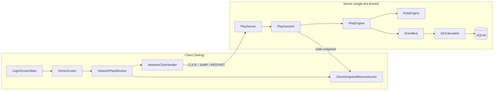

<div align="center">

# ♟ KFChess

**Real-time chess with no turns — a client–server implementation in Java**

[](https://openjdk.org/projects/jdk/17/)
[](https://maven.apache.org/)
[](https://junit.org/junit5/)
[](https://github.com/TooTallNate/Java-WebSocket)
[](https://www.sqlite.org/)

</div>

---

## Overview

KFChess ("kung-fu chess") is chess **without turns**. Both players may act at any
moment; a piece takes **real time to travel** between squares, and the board only
changes when it actually *arrives*. Whoever captures the enemy king wins.

The game is built as an **authoritative client–server system**: the server owns
the entire game state and every rule decision, while clients only send input and
render the snapshots they receive.

## Features

- ⚡ **Real-time engine** — simultaneous movement, travel time, and per-piece cooldowns
- 🌐 **WebSocket server** — multiple concurrent game rooms in a single process
- 🔐 **User accounts** — bcrypt-hashed passwords persisted in SQLite
- 📈 **ELO ratings** — updated automatically when a game ends
- 🤝 **Mutual rematch** — a restart requires both players to agree
- 🎮 **Desktop client** — Swing UI with animated movement and mouse controls
- 🧪 **Tested** — JUnit 5 suite covering the engine, protocol, and account layers

---

## Table of Contents

- [Quick Start](#quick-start)
- [Controls](#controls)
- [Architecture](#architecture)
- [Protocol](#protocol)
- [Project Structure](#project-structure)
- [Testing](#testing)
- [Tech Stack](#tech-stack)
- [הוראות הרצה בעברית](#הוראות-הרצה-מקוצרות-עברית)

---

## Quick Start

### Prerequisites

| Requirement | Version |
|---|---|
| JDK | **17** (a JDK, not just a JRE) |
| Maven | 3.6+ |

All libraries are resolved by Maven — nothing needs to be downloaded manually.

### Build

```bash
mvn clean test      # compile + run the full test suite
mvn clean package   # build the jar
```

> The application is launched from the IDE by running a main class directly,
> rather than from a packaged executable jar.

### Run

The game needs **one server process** plus **one client process per player**.

**1 — Start the server**

Run `kfchess.server.ServerMain`. In IntelliJ: open the file and click the
green ▶ beside `main`.

```
PlayServer started on port 8887
```

Leave it running. It creates and uses `kfchess.db` (the accounts database) in the
working directory on first use.

**2 — Start a client**

Run **`kfchess.app.LoginScreenMain`** — the single entry point for playing.

```
Login / Register  →  Home screen (pick a room)  →  Game window
```

- **Register** creates a new account (starting ELO **1200**); **Login** signs into
  an existing one.
- On the home screen, enter a room name (or keep `default`) and press **Connect**.
- The first client in a room becomes **White**, the second **Black**, and any
  further clients join as **spectators**.

**3 — Two players on one machine**

Start the server once, then launch `LoginScreenMain` **twice**. IntelliJ requires
this to be enabled explicitly:

```
Edit Configurations… → Modify options → ✔ Allow multiple instances
```

Sign in with **two different accounts** and connect both to the **same room name**.

> [!NOTE]
> Two *different* accounts matter for ratings: a game where both sides are the
> same account is skipped for ELO purposes.

---

## Controls

| Action | Input |
|---|---|
| Select a piece | **Left-click** the piece |
| Move the selected piece | **Left-click** the destination square |
| Jump / special action | **Right-click** |
| Rematch after game over | Click **Restart** — *both* players must click |

You can only select and move **your own** color; the server ignores clicks on
pieces that aren't yours.

When a king is captured, an overlay announces the winner and shows a **Restart**
button. Restart requires **mutual agreement**: once one side clicks, both screens
display *"Waiting for opponent…"*, and the board resets only after the second
player clicks as well.

---

## Architecture



**Design decisions**

- **Authoritative server.** The client holds no `PlayEngine`. Every rule decision —
  including rejecting clicks on the opponent's pieces — happens server-side, so a
  modified client cannot cheat.
- **Single-writer threading.** Commands arriving on network threads are queued;
  one tick thread drains the queue, advances every game, and broadcasts the
  results. Game state is never mutated from a network thread.
- **Stable piece IDs.** Each `Piece` carries an `id` assigned once at
  construction, so the client can recognise "the same piece as before" across
  separate JSON messages — which is what makes cooldown animations possible.
- **Shared rendering layer.** Snapshot construction and drawing are identical for
  the console and networked versions; only the data source differs.
- **Event bus.** Gameplay milestones (moves, score changes, sounds, lifecycle) are
  published to a `pub/sub` bus, keeping the engine decoupled from whatever reacts
  to them — for example, ELO updates subscribe to the end-of-game event.

---

## Protocol

JSON messages over WebSocket. The room name is the URI path and the logged-in
username is a query parameter:

```
ws://localhost:8887/<room>?username=<name>
```

**Client → Server**

| Type | Payload | Meaning |
|---|---|---|
| `CLICK` | `row`, `col` | Select a piece, or move the selected one |
| `JUMP` | `row`, `col` | Jump / special action |
| `RESTART` | — | Vote for a rematch (requires both players) |

**Server → Client**

| Type | Contents |
|---|---|
| `ROLE_ASSIGNED` | Assigned role (`WHITE` / `BLACK` / `SPECTATOR`) and room id |
| `SNAPSHOT` | Full game state: pieces, motions, jumps, capture effects, scores, selection, game-over flags |
| `ERROR` | Description of a malformed or invalid command |

Snapshots are **per-viewer**: every client receives the same game state, but only
its own selection highlight and its own restart vote.

---

## Project Structure

```
src/main/java/kfchess/
├── model/                 Board, Piece, Position, colors / kinds / states / ClientRole
├── rules/                 RuleEngine + PieceRules (per-piece legality)
├── realtime/              RaelTime (game clock), Motion (piece in transit)
├── engine/                PlayEngine, MoveHistory, NetworkActions
│   └── snapshot/          SnapshotFactory + immutable PlaySnapshot view model
├── bus/                   EventBus (pub/sub) + game event types
├── io/                    BoardParser (text board format, used by the Restart feature)
├── view/                  Swing rendering, animation, images
│   └── layout/            BoardLayoutCalculator (screen geometry)
├── input/                 BoardMapper (pixel ↔ board coordinates)
├── account/               Accounts, bcrypt hashing, SQLite repo, EloCalculator
├── protocol/              Shared WebSocket DTOs (ClientCommand, SnapshotMessage, ...)
├── server/                PlayServer, PlaySession, ServerMain, resolvers
├── client/                PlayClient, snapshot reconstruction, click handling
└── app/                   Client entry points
    ├── LoginScreenMain    ← entry point: login / register
    ├── HomeScreen         ← room selection
    └── NetworkPlayWindow  ← the game window
```

**Entry points**

| Class | Purpose |
|---|---|
| `kfchess.server.ServerMain` | WebSocket server — run once |
| `kfchess.app.LoginScreenMain` | Player client — run once per player |

---

## Testing

```bash
mvn clean test
```

Tests live in `src/test/java/texttests/` and use **JUnit 5**. They cover the pure
logic layers — movement rules, board parsing, protocol DTOs, snapshot
reconstruction, session and room behaviour, accounts and ELO — and run without a
server or a display.

Rather than a mocking framework, the suite uses hand-written test doubles
(`FakeWebSocket`, `RecordingPlayClient`) in place of real network objects, which
keeps the tests fast and deterministic.

---

## Tech Stack

| Library | Version | Purpose |
|---|---|---|
| [Java-WebSocket](https://github.com/TooTallNate/Java-WebSocket) | 1.6.0 | WebSocket server and client |
| [Gson](https://github.com/google/gson) | 2.14.0 | JSON serialisation |
| [sqlite-jdbc](https://github.com/xerial/sqlite-jdbc) | 3.46.1.3 | Account persistence |
| [jBCrypt](https://www.mindrot.org/projects/jBCrypt/) | 0.4 | Password hashing |
| [JUnit Jupiter](https://junit.org/junit5/) | 5.11.0 | Testing |
| Swing | JDK | Desktop UI |

---

## הוראות הרצה מקוצרות (עברית)

1. **דרישות**: Java 17 (JDK) ו-Maven.
2. **הרצת השרת** — מריצים את המחלקה `kfchess.server.ServerMain`.
   אמורה להופיע השורה `PlayServer started on port 8887`. משאירים אותו רץ.
3. **הרצת הלקוח** — מריצים את **`kfchess.app.LoginScreenMain`**
   (נקודת הכניסה **היחידה** למשחק).
   - **Register** ליצירת חשבון חדש (דירוג התחלתי 1200), או **Login** לחשבון קיים.
   - במסך הבית מזינים שם חדר (או משאירים `default`) ולוחצים **Connect**.
   - הראשון שמתחבר לחדר מקבל **לבן**, השני **שחור**, השאר **צופים**.
4. **שני שחקנים על אותו מחשב** — מריצים את `LoginScreenMain` פעמיים.
   ב-IntelliJ יש לאפשר זאת: `Edit Configurations…` → `Modify options` →
   **Allow multiple instances**. מתחברים עם **שני חשבונות שונים** לאותו שם חדר
   (חשבונות שונים חשובים כדי שדירוג ה-ELO אכן יתעדכן).
5. **שליטה** — קליק שמאלי לבחירת כלי, קליק שמאלי נוסף ליעד, קליק ימני לקפיצה.
   בסיום המשחק מופיע כפתור **Restart**, ו**שני** הצדדים חייבים ללחוץ עליו כדי
   שהלוח יתאפס (עד אז מוצג "Waiting for opponent…").
6. **טסטים** — `mvn clean test`.
